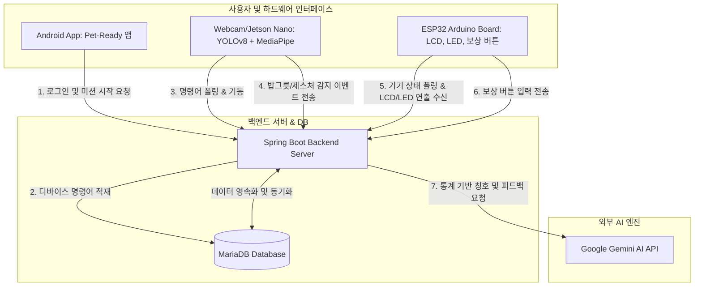

# 🐾 Pet-Ready: IoT-AI 통합 반려견 양육 시뮬레이션 에코시스템

**Pet-Ready**는 실제 반려견을 입양하기 전, 반려견의 생활 패턴과 라이프 사이클을 가상으로 시뮬레이션하며 양육 자격을 검증할 수 있도록 설계된 **IoT 및 비전 AI 융합 가상 반려견 양육 시뮬레이션 시스템**입니다. 

본 리포지토리는 로컬 웹캠 비전 센서(YOLOv8 + MediaPipe), 아두이노 하드웨어(ESP32), 모바일 앱(Android), 스프링 부트(Spring Boot) 백엔드, 그리고 Google Gemini AI를 유기적으로 통합하고 상호 작용 규칙을 구현한 완성형 마스터 프로젝트입니다.

---

## 📊 1. 전체 시스템 아키텍처 (System Architecture)

본 프로젝트는 디바이스 간 유기적인 이벤트 기반 통신을 수행하며, 중앙 백엔드 서버를 통해 모든 데이터가 동기화됩니다.



---

## ⚙️ 2. 안드로이드 클라이언트 핵심 비즈니스 로직

안드로이드 모바일 앱은 사용자의 일일 돌봄 행동률과 점수를 로컬에서 실시간 반영하고 저장(`SharedPreferences`)하도록 구성되어 있습니다.

### 1) 가상 펫 상태 변화 공식 (`CareStatusRepository`)
* **가상 배터리 (방전율)**: 기동 시점 이후 **1시간마다 1씩 감소**합니다 (최소 0, 최대 100).
* **배고픔 지수 (포만감)**: **12시간 식사 주기**를 기준으로 경과한 시간에 비례하여 **최대 50까지 감쇠**합니다.
  $$\text{배고픔 감소량} = \text{round}\left( \min(1.0, \frac{\text{경과시간(ms)}}{12\text{시간}}) \times 50 \right)$$
* **친밀도**: 일반/긴급 미션을 완료할 때마다 **+3씩 증가**합니다.
* **급여 연동**: 앱/아두이노를 통한 밥주기 미션 완료 시 **배고픔 수치가 즉시 100으로 완전 리셋**됩니다.

### 2) 양육 점수 산출 공식 (`ScoreRepository`)
모든 점수는 100점 만점으로 시작하며, 사용자의 성실도와 대응 반응 속도에 따라 동적으로 가감됩니다.
* **산책 점수 (목표 2.0km 기준)**:
  * 100% 이상 달성 시 (`WALK_FULL`): **+5점**
  * 70% ~ 100% 미만 달성 시 (`WALK_PARTIAL_HIGH`): **+2점**
  * 30% ~ 70% 미만 달성 시 (`WALK_PARTIAL_LOW`): **-3점**
  * 30% 미만 달성 시 (`WALK_NONE`): **-5점**
* **미션 반응 속도 기반 점수**:
  * 5분(300초) 이내 수동/자동 완료 (`MISSION_FAST_COMPLETE`): **+5점**
  * 15분(900초) 이내 완료 (`MISSION_NORMAL_COMPLETE`): **+2점**
  * 30분(1800초) 이내 완료 (`MISSION_LATE_COMPLETE`): **-3점**
  * 30분 초과 미해결 방치 (`MISSION_NO_RESPONSE`): **-10점**
  * 시간 정보가 없는 경우: 급여 미션 성공은 **+3점**, 일반 미션은 **+2점**
* **점수 영역 분리**:
  * **건강 점수 (`care_score`)**: 급여, 돌봄, 병원 진료, 예방 접종 관련 미션 성공 시 가산.
  * **응답 점수 (`mission_score`)**: 짖음 알림 대응, 로봇 놀아주기 등 일반 미션 성공 시 가산.
  * **산책 점수 (`walk_score`)**: GPS 산책 데이터 수집율 연동.
  * **종합 점수 (`current_score`)**: 모든 영역의 가감 내역이 종합 산출되어 실시간 누적 반영.

---

## 🛠️ 3. 안드로이드-백엔드 유기적 연동 및 연동 정렬 가이드 (Android Team Action Item)

현재 안드로이드 프로젝트(`temp-pr-1`)의 코드가 백엔드의 표준 스펙과 완벽히 매칭되어 실시간 시연 및 연동이 성공할 수 있도록, **안드로이드 클라이언트 측에서 수정해야 할 3가지 연동 정렬 사항**입니다. (백엔드 코드는 표준 보안 및 유효성 검증을 위해 기존 스펙을 유지합니다.)

### 1) 산책 종료 기록 API (`POST /api/v1/walk/end`) 필드 매칭
* **현상**: 백엔드 `WalkEndRequest` DTO는 사용자와 시작 시간을 매핑하기 위해 `userId`와 `startedAt` 필드를 필수로 요구하고 있습니다. 그러나 현재 안드로이드의 `WalkEndRequest` 클래스에는 해당 두 필드가 선언되어 있지 않아 전송 시 백엔드에서 `400 Bad Request` 에러가 납니다.
* **조치 방안 (안드로이드 수정)**: 
  안드로이드 프로젝트의 `com/example/pet/model/WalkEndRequest.java` 파일에 누락된 필드를 추가하고 생성자에서 값을 채워주도록 수정합니다.
  ```java
  public class WalkEndRequest {
      private static final SimpleDateFormat ISO_FORMAT =
              new SimpleDateFormat("yyyy-MM-dd'T'HH:mm:ssXXX", Locale.KOREA);

      public Long userId;      // 추가 (로그인한 유저의 ID 바인딩)
      public String startedAt; // 추가 (산책 시작 타임스탬프)
      public String deviceId;
      public String endedAt;
      public double distanceKm;
      public long durationSec;

      public WalkEndRequest(long startedAtMillis, long endedAtMillis, long durationSeconds, float distanceMeters) {
          this.userId = 1L; // (로그인 정보에서 유저 ID를 주입하거나 데모용 1L 매핑)
          this.startedAt = ISO_FORMAT.format(new Date(startedAtMillis)); // 시작 시각 변환 추가
          this.deviceId = "DOG_01";
          this.endedAt = ISO_FORMAT.format(new Date(endedAtMillis));
          this.distanceKm = distanceMeters / 1000.0;
          this.durationSec = durationSeconds;
      }
  }
  ```

### 2) 오늘의 미션 조회 API 경로 매칭 (`/history` ➡️ `/today`)
* **현상**: 안드로이드 앱의 `ApiService.java`에서는 오늘의 미션 조회를 위해 **`/api/v1/mission/history`**를 호출하도록 되어 있으나, 백엔드 서버에는 **`/api/v1/mission/today`** 경로로 엔드포인트가 구축되어 있어 미션 목록을 띄우지 못하는 문제가 발생합니다.
* **조치 방안 (안드로이드 수정)**:
  안드로이드 프로젝트의 `com/example/pet/api/ApiService.java` 파일에서 호출 엔드포인트를 백엔드 경로와 동일하게 `/today`로 수정해 줍니다.
  ```java
  // AS-IS
  @GET("mission/history")
  Call<JsonElement> getTodayMissions(@Header("Authorization") String authorization);

  // TO-BE
  @GET("mission/today")
  Call<JsonElement> getTodayMissions(@Header("Authorization") String authorization);
  ```

---

## 💡 4. 최종 리포트 API (Gemini AI & 실물 유기견 매칭) 연동 구조 제언

현재 안드로이드 프로젝트(`temp-pr-1`)의 `FinalReportActivity`는 최종 시뮬레이션 종료 리포트를 로컬 SharedPreferences 데이터를 기반으로 자체 연산(`ReportAnalysisRepository`)하여 화면에 출력하고 있습니다.

하지만 백엔드에는 **돌봄 성적 50% + 훈련 성적 50%**의 종합 점수를 계산하고, **Google Gemini AI를 호출하여 초개인화된 분석 총평 및 특색 있는 칭호(예: `[칭호: 댕댕이 소통의 신]`)를 하사하는 `/api/v1/report/final` API**가 성공적으로 구축되어 있습니다. 
또한 데이터베이스 내 공공데이터 구조견 정보를 성향에 따라 지능형 매칭해 주는 기능이 백엔드에 존재합니다.

* **발표 완성도 향상을 위한 연동 제안**:
  * 안드로이드의 `ReportAnalysis` 모델 클래스는 백엔드의 `FinalReportResponse` DTO와 변수명 및 데이터 구조가 100% 일치합니다.
  * 따라서 시연의 완성도를 끌어올리기 위해 안드로이드 앱의 `FinalReportActivity`에서 로컬 리포지토리 대신, 백엔드의 **`GET /api/v1/report/final`** API를 호출하여 화면을 동적으로 바인딩할 것을 강력히 권장합니다.

---

## 🚀 5. 발표 및 시연(Live Demo) 가이드

### 1단계: 개발 환경 기동 (사전 준비)
1. **로컬 데이터베이스 가동**
   ```bash
   brew services start mariadb@10.11
   ```
2. **백엔드 스프링 부트 서버 시작** (포트 8080)
   ```bash
   cd pet-ready-backend
   gradle bootRun
   ```
3. **비전 실시간 제어 스크립트 실행**
   ```bash
   python3 vision_bowl_local_detector_event.py
   ```
   * *기동 후 로그 확인*: `📡 백엔드 서버 연결 대기 중 (상태: STANDBY)...` 문구가 출력되며 카메라 창이 열리지 않고 대기 중이어야 정상입니다.

### 2단계: 밥그릇(급여) 미션 시연
1. 모바일 앱 또는 관리자 테스트 도구를 통해 `DOG_01` 기기에 **`FEEDING` 미션을 시작**합니다.
   * 백엔드에서 비전 기동 명령어(`START_VISION`)가 큐에 적재됩니다.
2. 4초 이내에 비전 스크립트가 명령어를 감지하고 **카메라 프레임 창이 팝업**됩니다.
3. 카메라 렌즈 앞에 실물 **밥그릇(또는 컵/원반 등 대용물)**을 보여줍니다.
4. 화면에 `Bowl Locking...` 게이지가 차오르며 `BOWL: UNLOCKED` 녹색 사각형 테두리가 화면에 표시되는지 관중에게 보여줍니다.
5. 밥그릇을 치우면 `🍃 밥그릇 이탈 감지` 로그와 함께 카메라 창이 안전하게 자동 종료되고 다시 `STANDBY` 대기 상태로 전환됩니다.

### 3단계: 제스처 훈련 & 3초 락아웃 시연
1. 백엔드 명령어 큐에 강제로 `START_VISION`을 주입하여 카메라를 켭니다.
2. 카메라 앞에 **검지 손가락 하나만** 똑바로 세워 가리키는 동작을 취합니다.
   * 화면에 `SIT` 감지 게이지가 차오르고 `🎯 [제스쳐 확정] SIT 감지` 문구가 출력됩니다.
3. **60초 골든타임 시연**: 제스처 감지 즉시 백엔드에서 60초 카운트다운 타이머가 비동기로 작동하기 시작합니다.
4. **보상 버튼 클릭**: 아두이노 보상 버튼을 누르거나 API(/reward)를 강제 호출합니다.
   * 백엔드가 즉시 훈련 성공을 판정하고 `SUCCESS` 결과와 함께 아두이노 LCD/LED 제어용 패킷(`GREEN` 색상 및 행복 표정 `(^_^)`)을 반환합니다.
   * 화면에 **3초 락아웃 연출**이 고정 표시되는지 확인합니다.

### 4단계: Gemini AI 최종 리포트 및 칭호 확인 시연
1. 시뮬레이션 종료 리포트 API(`/api/v1/report/final`)를 호출하여 브라우저 혹은 응답 화면으로 최종 보고서를 엽니다.
2. 맨 윗줄 총평에 사용자의 훈련 통계가 반영되어 Gemini AI가 부여한 **맞춤형 댕댕이 칭호**가 생성되어 표출되는 것을 보여주며 발표를 마무리합니다.
