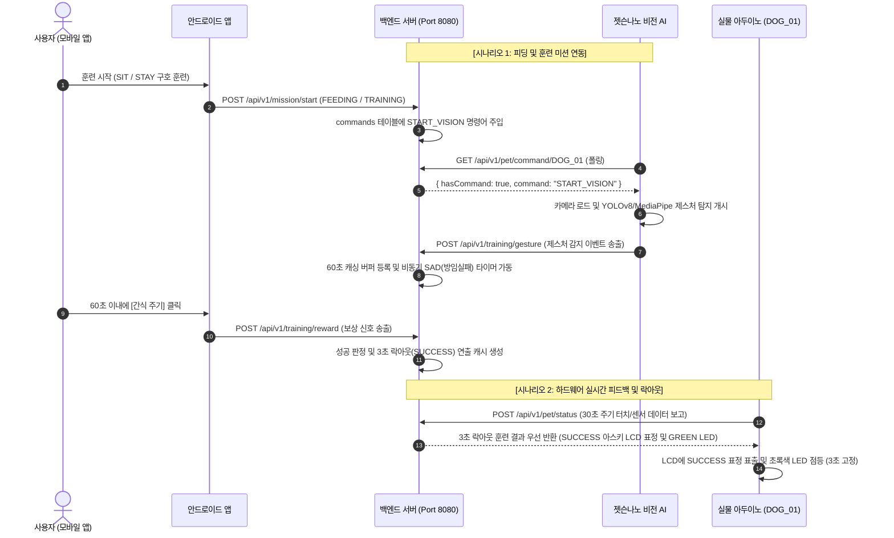

# 🐾 Pet-Ready: IoT 연동 가상 반려견 사전 양육 시뮬레이션 플랫폼 (v2.3)

충동 입양 및 파양률 감소를 목적으로, **실물 IoT 로봇견 기기(아두이노)**와 **모바일 앱(안드로이드)**, **실시간 엣지 비전 AI(젯슨나노)**, 그리고 **백엔드 서버(Spring Boot)**가 하나로 결합된 통합 하이브리드 사전 양육 시뮬레이션 플랫폼입니다.

---

## 🔄 1. 전체 시스템 연동 아키텍처

본 시스템은 기기 상태 제어, 훈련 감지, 산책 정산, 그리고 양육 적합도 분석을 위해 4대 컴포넌트가 실시간으로 상호작용합니다.



---

## 🛠️ 2. 플랫폼별 핵심 기능 및 기동 가이드

### 1) 백엔드 서버 (Spring Boot)
* **핵심 기능**: 
  - JWT 기반 보안 인증 및 기기 등록/소유권 검증 (JWT 이메일 기반 크로스 매핑).
  - 24시간 실시간 펫 라이프 사이클 시뮬레이션 스케줄러 (`RoutineStatus` Enum 판별).
  - 5:5 척도로 개편된 돌봄/훈련 Readiness Score 산출 및 **Gemini AI 기반 맞춤형 양육 칭호/총평 자동 생성**.
  - `ApplicationReadyEvent` 리스너 적용으로 시작 시점의 DB 커넥션 락 경합 전면 해소.
* **기동 방법 (젯슨나노 메모리 OOM 방지 Jar 기동)**:
  - 젯슨나노(RAM 4GB)에서 Gradle 빌드 데몬과 자바 실행 데몬이 동시에 떠서 메모리가 폭발하는 문제를 방지하기 위해 Jar 빌드 후 단독 실행으로 최적화 적용 완료.
  ```bash
  cd ~/Pet-Ready/pet-ready-backend
  # 빌드 후 Jar 단독 백그라운드 가동
  nohup ./run_server.sh > backend.log 2>&1 &
  # 실행 로그 확인
  tail -f backend.log
  ```

### 2) 모바일 앱 (안드로이드)
* **핵심 기능**:
  - QR 코드를 통한 기기 등록(`POST /api/v1/device/register`) 및 `DOG_01` 기기 ID 로직 정합성 통일.
  - GPS 좌표 경로(`route`) 및 포맷팅된 시작 시각(`startedAt`: `yyyy-MM-dd'T'HH:mm:ss`)을 완벽 수용하는 **산책 정산 API** 구현.
  - Gemini AI 칭호 및 추천 유기견 정보 카드 목록을 연동하여 동적으로 렌더링하는 최종 리포트 화면 구현.
  - 파이어베이스 접속 보안 파일(`google-services.json`) 및 구글 맵 API Key 하드코딩 제거 완료 (`local.properties` 기반 빌드 플레이스홀더 주입 방식 적용).

### 3) 실물 IoT 로봇견 (아두이노 - ESP32)
* **핵심 기능**:
  - FSR 압력 센서(머리, 등 2곳)를 활용한 터치 상호작용 및 30초 주기 상태 보고.
  - 서버 응답 바디(`lcdTextLine1`/`lcdTextLine2`)에 맞춘 실시간 **아스키 LCD 표정 출력** (깜빡임 방지 알고리즘 적용).
  - Wi-Fi 또는 서버 연결 실패 시 터치 데이터를 SD 카드의 `/buffer.txt`에 누적하고, 무선 네트워크가 복구되는 즉시 서버로 몰아서 전송(Burst 송신)하는 오프라인 이중 안전망 구축.
* **컴파일 설정**:
  - 와이파이 암호 등 민감 정보는 `secrets.h`로 격리되어 깃허브에서 제외되어 있습니다.
  - **조치**: 빌드 전 `secrets_example.h` 파일을 복사해 `secrets.h` 파일을 만들고 사용 환경의 Wi-Fi SSID와 비밀번호를 기입한 뒤 아두이노 IDE를 통해 업로드해 주세요.

### 4) 비전 AI (젯슨나노 - YOLOv8 + MediaPipe)
* **핵심 기능**:
  - 로컬 웹캠 비전 카메라를 통해 반려견 오브젝트(밥그릇/접시)와 SIT/STAY 제스처를 실시간 감지.
  - 젯슨나노 연산 부하 완화를 위해 6프레임당 1회 연산 스킵 렉 방지 패치 및 헤드리스(`HEADLESS_MODE = True`) 백그라운드 무선 기동 최적화 완료.
* **기동 방법**:
  ```bash
  sudo chmod 666 /dev/video0
  cd ~/Pet-Ready
  # 가상환경 격리 실행
  sudo ~/pet_venv/bin/python3 vision_bowl_local_detector_event.py
  ```

---

## 📡 3. 핵심 REST API 연동 요약 (DOG_01 기준)

### ① 하드웨어 상태 전송 및 디스플레이 제어
* **Endpoint**: `POST /api/v1/pet/status`
* **Request Body**:
  ```json
  {
    "deviceId": "DOG_01",
    "headTouch": true,
    "backTouch1": false,
    "backTouch2": false
  }
  ```
* **Response Body**:
  ```json
  {
    "ledColor": "GREEN",
    "lcdCommand": "DISP_TEXT",
    "lcdTextLine1": " (  ≧  ▽  ≦  ) ",
    "lcdTextLine2": "   SO HAPPY     "
  }
  ```

### ② 산책 종료 및 GPS 정산 (안드로이드 -> 백엔드)
* **Endpoint**: `POST /api/v1/walk/end`
* **Authorization**: `Bearer <Access_Token>`
* **Request Body**:
  ```json
  {
    "deviceId": "DOG_01",
    "startedAt": "2026-06-11T14:00:00",
    "endedAt": "2026-06-11T14:30:00",
    "distanceKm": 2.45,
    "durationSec": 1800,
    "route": [
      {"lat": 37.5665, "lng": 126.9780},
      {"lat": 37.5670, "lng": 126.9785}
    ]
  }
  ```
