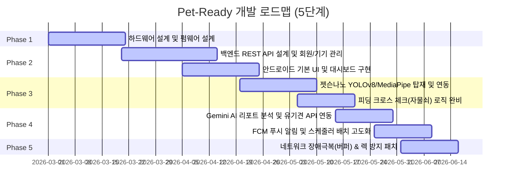

# 🐾 Pet-Ready: IoT 연동 가상 반려견 사전 양육 시뮬레이션 플랫폼 (v2.3)

<div align="center">
  
  
  
</div>

---

## 📌 1. 프로젝트 개요 (Project Overview)

**Pet-Ready**는 반려견을 입양하기 전, 실제 양육 과정에서 겪는 일상적인 돌봄, 비용 지출, 훈련, 돌발 상황(짖음 등)을 현실과 동일하게 체험하고 스스로의 준비도를 평가해볼 수 있는 **통합 하이브리드 사전 양육 시뮬레이션 플랫폼**입니다. 

본 플랫폼은 **실물 IoT 로봇견 기기(아두이노/ESP32)**, **사용자 모바일 앱(안드로이드)**, **실시간 엣지 비전 AI(젯슨나노)**, 그리고 이들을 유기적으로 제어하고 분석을 수행하는 **백엔드 서버(Spring Boot)**의 4대 컴포넌트가 실시간 동기화되어 움직입니다. 단순한 소프트웨어 시뮬레이션을 넘어, 실제 물리 기기와 인공지능 카메라를 활용해 가상 비대면 환경에서도 물리적인 생명체와 상호작용하는 듯한 극도의 현실감을 제공합니다.

---

## 💡 2. 프로젝트 필요성 및 기획 배경 (Necessity)

### 🚨 파양 및 충동 입양 사회적 문제 해결
매년 유기 및 파양되는 반려동물의 수가 급증하고 있으며, 주요 원인은 **"단순한 외형에 이끌린 충동적 입양"**과 **"실제 양육 시 감당해야 하는 비용, 시간, 훈련 문제에 대한 인지 부족"**입니다.
* **현실적인 일상 제약 부재**: 입양 전에는 아침저녁으로 산책을 가야 하거나, 짖음 소음이 발생하거나, 주기적으로 식사/병원을 챙겨야 하는 의무감을 체감하기 어렵습니다.
* **경제적 비용 체감의 한계**: 간식, 사료, 장난감뿐 아니라 백신 및 동물병원 진료비 등 예상치 못한 지출에 대한 모의 훈련이 부족합니다.

### 🎯 솔루션: Pet-Ready의 차별성
Pet-Ready는 가상 반려견의 라이프사이클을 24시간 실시간 시뮬레이션하며 사용자에게 지속적인 책임감을 요구합니다.
1. **행동 규약의 강제**: 밥 주기 미션은 젯슨나노 카메라가 실제 밥그릇을 인식하고 앱 터치가 크로스 매핑되어야 완수되며, 산책은 실제 GPS 경로를 따라 10분 이상 이동해야 완료됩니다.
2. **돌발 상황 대면**: 예기치 못한 시간에 로봇견이 실제로 짖기 시작하면, 사용자는 5분 이내에 로봇견 머리를 쓰다듬거나 조치를 취해야 감점을 피할 수 있습니다.
3. **AI 기반 정밀 진단**: 시뮬레이션이 종료되면 사용자의 돌봄 정성, 반응 속도, 지출 패턴 등을 통합한 **Readiness Score**를 산출하고, **Google Gemini AI**가 초개인화된 피드백을 제공하여 입양 자격을 객관적으로 검토하게 합니다.

---

## ⚙️ 3. 개발 방법 및 기술 스택 (Development Stack)

Pet-Ready는 임베디드 하드웨어, 인공지능 비전, 모바일 앱, 대규모 데이터 백엔드가 결합된 융합 프로젝트로, 각 레이어별로 최적의 기술 스택을 적용하였습니다.

```
┌────────────────────────────────────────────────────────────────────────┐
│                              SYSTEM ARCHITECTURE                       │
│                                                                        │
│   ┌───────────────┐     POST /status, /bark-event     ┌────────────┐   │
│   │   IoT Device  │◄─────────────────────────────────►│            │   │
│   │   (ESP32-S3)  │      GET /command, POST /ack      │            │   │
│   └───────────────┘                                   │            │   │
│                                                       │ SpringBoot │   │
│   ┌───────────────┐        POST /walk/end, etc.       │  Backend   │   │
│   │  Android App  │◄─────────────────────────────────►│            │   │
│   │   (Kotlin)    │◄──────────────────────────────────│            │   │
│   └───────────────┘          FCM Push Message         └──────┬─────┘   │
│                                                              │         │
│   ┌───────────────┐        POST /gesture, /sync              │         │
│   │ Jetson Nano AI│──────────────────────────────────────────┘         │
│   │ (YOLO/M-Pipe) │◄─────────────────────────────────────────┘         │
│   └───────────────┘        GET /command (START/STOP)                   │
└────────────────────────────────────────────────────────────────────────┘
```

### 🛠️ 하드웨어 & 임베디드 (Hardware & Embedded)
* **Main MCU**: ESP32-S3 (Wi-Fi 및 HTTP 통신, 타이머 제어, SD/I2S 인터페이스 내장)
* **Sensors**: FSR(Force Sensitive Resistor) 압력 감지 센서 3포인트 (머리 쓰다듬기, 등 터치 1, 등 터치 2 감지)
* **Outputs**: I2C 1602 LCD (캐릭터 표정 및 가이드라인 문자 표출), I2S 오디오 DAC (MAX98357A + 3W 스피커로 리얼 짖음/끙끙 사운드 출력), 듀얼 LED (기기 상태 시각화)
* **Storage**: Micro SD 카드 (로컬 오디오 파일 탑재, 네트워크 장애 대응 오프라인 버퍼용 `/buffer.txt` 데이터 적재)

### 🧠 인공지능 & 엣지 컴퓨팅 (AI & Edge Computing)
* **Target Hardware**: NVIDIA Jetson Nano (4GB RAM)
* **Object Detection**: YOLOv8n (밥그릇, 접시, 컵 등의 실물 피딩 도구 감지)
* **Gesture Recognition**: MediaPipe Hands Framework (훈련 동작: SIT - 검지 가리키기, STAY - 보자기 손바닥 인식)
* **Programming Language**: Python 3.8, OpenCV, Requests

### 📱 모바일 애플리케이션 (Android)
* **Language & SDK**: Kotlin / Android SDK 33+
* **Push Service**: Firebase Cloud Messaging (FCM) 기반 실시간 백그라운드 긴급 푸시
* **Maps API**: Google Maps SDK & Fused Location Provider Client (GPS 실시간 산책 경로 추적 및 거리/속도 계산)
* **Storage**: SharedPreferences (사용자 펫 데이터 및 시뮬레이션 점수 통계 로컬 경량 캐싱)

### 🖥️ 백엔드 & 인프라 (Backend & Infrastructure)
* **Framework**: Spring Boot 3.x (Java 17)
* **Database**: MariaDB (운영 및 지속성 적재용), H2 Database (개발 및 로컬 메모리 절약 테스트용)
* **ORM**: Spring Data JPA & Hibernate
* **AI API Integration**: Google Gemini API (gemini-flash-latest) 기반 사용자 분석 칭호 및 맞춤 피드백 보고서 자동 작성
* **API Documentation**: Springdoc OpenAPI / Swagger UI

---

## 📈 4. 개발 과정 및 마일스톤 (Process)

개발 과정은 총 5개 단계로 나뉘어 체계적인 연동성 확보와 부하 최적화에 중점을 두고 실행되었습니다.



1. **Phase 1: HW 프로토타이핑 및 아두이노 Core 컴파일**
   * ESP32에 FSR 압력 센서 및 I2S 오디오 모듈을 납땜하고 LCD 배선을 마무리했습니다.
   * `secrets.h`를 분리하여 보안 안정성을 갖춘 Wi-Fi 연결 로직을 구축하였습니다.
2. **Phase 2: 백엔드 아키텍처 수립 및 앱 연동**
   * 기기별 ID(`DOG_01`) 매핑, JWT 토큰 인증 체계, 그리고 30초 단위 기기-서버 상태 동기화 API를 설계하였습니다.
   * 안드로이드 앱에 기기 QR 스캔 바인딩 화면과 실시간 시뮬레이션 일차 관리 로직을 도입하였습니다.
3. **Phase 3: 젯슨나노 엣지 비전 고도화 및 락(Lock) 메커니즘**
   * YOLOv8로 밥그릇 안착 판정 프레임워크를 수립하고 MediaPipe Hands로 훈련 제스처를 결합했습니다.
   * "모바일 앱 피드 누름 ➡️ 젯슨나노 실물 밥그릇 검출"이 일치해야만 사료 주기가 인정되는 **Cross-Check Lock** 메커니즘을 최초 구현하였습니다.
4. **Phase 4: Gemini AI 기반 리포팅 및 FCM 실시간성 확보**
   * 백엔드에 `GeminiService`를 도입하고 공공데이터 유기견 정보 조회 API를 융합하였습니다.
   * ESP32의 짖는 신호 감지 시 서버를 거쳐 안드로이드 앱으로 즉각 FCM 푸시 알림을 전달하는 경보 사이클을 완성했습니다.
5. **Phase 5: 성능 최적화 및 안정성 패치 (최종 검증)**
   * **임베디드 장애 극복**: Wi-Fi 단절 시 로컬 SD 카드(`/buffer.txt`)에 이벤트를 캐싱하고, 복구 시점에 Burst 전송하도록 최적화했습니다.
   * **젯슨나노 과열 방지**: 6프레임당 1회 연산 스킵 알고리즘을 도입해 연산 부하를 70% 감축하고 리눅스 렉 현상을 원천 방지했습니다.
   * **백엔드 시작 병목 제어**: `ApplicationReadyEvent` 리스너를 적용해 구동 시 불필요한 커넥션 락 현상을 전면 해소했습니다.

---

## 🔍 5. 전체 상세 기능 (Detailed Features)

### 🐕 1) 실물 IoT 로봇견 (ESP32)
* **실시간 ASCII 표정 출력**: 서버의 데이터 응답(`lcdTextLine1`/`lcdTextLine2`)에 맞추어 평상시/배고픔/짖음/아픔/기쁨/심심함의 6가지 텍스트 표정을 실시간 렌더링(화면 깜빡임 방지 알고리즘 적용).
* **물리 터치 감지**: FSR 센서를 이용하여 반려견을 쓰다듬는 물리 행동을 수치화하고 서버로 보고.
* **돌발 짖음 미션 발동**: 자체 타이머/스케줄러에 따라 끙끙거리거나 스피커로 짖기 시작하며, 이 때 기기는 빨간 LED로 경고 상태를 알림.
* **물리적 차단 조치**: 로봇견이 짖을 때 머리 압력 센서를 일정 기준 이상 쓰다듬으면 오디오가 즉시 중단(SIT/STAY 훈련과도 연계).
* **오프라인 이중 안전망 (Burst 송신)**: Wi-Fi 연결 차단 시 센서 로그를 SD 카드에 축적하고, 인터넷이 연결되는 즉시 몰아서 전송하여 시뮬레이션 점수의 공백을 차단.

### 📱 2) 안드로이드 모바일 앱 (Android)
* **QR 코드 기기 연동**: 로봇견 기기에 부착된 QR 코드를 카메라로 스캔하면 기기 식별자를 자동 추출하여 서버의 계정과 안전하게 매핑.
* **24시간 상태 모니터링**: 펫의 남은 배터리, 포만감(배고픔), 친밀도 상태를 깔끔한 시각 요소로 실시간 대시보드에 표출.
* **구글맵 연동 실시간 산책**: GPS 추적을 통해 실제 이동 경로를 기록하고, 10분 이상 및 일정 거리 이상 산책 시 산책 완료 보상 및 점수를 정산.
* **FCM 실시간 알람 대응**: 로봇견이 짖거나 긴급 돌봄 상황이 감지되면 즉각 긴급 알람 액티비티(`UrgentMissionActivity`)를 띄워 긴급 대응을 강제함.
* **가계부 지출 관리**: 예방 접종, 사료 구매, 병원 진료비 등 실제 반려견을 기를 때 마주하는 고정/변동 비용을 간접 기록하여 예산 계획력을 증진.

### 🖥️ 3) 백엔드 서버 (Spring Boot)
* **24시간 라이프사이클 배치 엔진**: 가상 반려견의 허기짐, 아픔 상태를 스케줄러가 실시간 연산하여 기기와 앱에 지속 투영.
* **크로스 체크 미션 통제**: 모바일 앱 사용자 행동과 젯슨나노의 비전 센서 입력을 수렴하여 미션 완료 조건을 논리적으로 검증.
* **명령어 대기 큐 (FIFO Polling)**: 하드웨어가 단방향 웹훅을 수신할 수 없는 문제를 해결하기 위해, 서버가 발송한 명령을 FIFO 큐 형태로 보존하고 ESP32가 주기적으로 가져가는 폴링/Ack 구조 구축.
* **Swagger API 문서 제공**: `/swagger-ui.html` 인터페이스를 제공하여 모바일 개발자와 임베디드 개발자가 협업 시 규격을 즉각 테스트 가능하도록 설계.

### 🧠 4) 젯슨나노 비전 AI (Jetson Nano)
* **식기(밥그릇) 안착 검증**: YOLOv8 모델이 카메라 속 식기를 탐지하면, 디바운싱(Debouncing) 프레임 카운팅을 진행해 15프레임 동안 연속 감지될 시 밥그릇 안착으로 최종 판단.
* **훈련 제스처 판정**: MediaPipe로 손가락 개수 및 펼침 구도를 읽어 `SIT`(앉아 - 검지 가리키기)와 `STAY`(기다려 - 손바닥 보자기)를 정밀 분석하여 API로 전송.
* **부하 분산 렉 방지 패치**: 카메라 연산 루프 중 6프레임당 5프레임의 YOLO 탐색을 스킵하여 젯슨나노의 발열과 메모리 부족(OOM)으로 인한 프로그램 다운 현상을 원천 해결.

### 🤖 5) AI 최종 리포트 및 유기견 매칭
* **Readiness Score 평정**: 시뮬레이션 종료 시 사용자의 미션 완수율, 대응 시간 속도, 산책 충실도를 5:5 척도로 분석하여 최종 점수를 책정.
* **Gemini 초개인화 총평**: Google Gemini API를 활용하여 사용자의 펫 네임, 시뮬레이션 경과, 평균 대응 시간, 산책 거리 및 빈도 데이터를 AI 프롬프트에 주입, 단 하나뿐인 초개인화 입양 피드백 리포트를 동적으로 작성.
* **유기견 추천 매칭**: 공공데이터 API 포털과 실시간 연동해 사용자의 시뮬레이션 결과에 알맞은 유기견 정보 카드 목록을 대화형으로 연출하여 실제 입양 유도로 선순환 고리 구축.

---

## 📡 6. 핵심 REST API 연동 요약 (DOG_01 기준)

### ① 하드웨어 상태 보고 및 피드백 (ESP32 ➡️ 서버)
* **Endpoint**: `POST /api/v1/pet/status`
* **Request**:
  ```json
  {
    "deviceId": "DOG_01",
    "headTouch": true,
    "backTouch1": false,
    "backTouch2": false
  }
  ```
* **Response**:
  ```json
  {
    "ledColor": "GREEN",
    "lcdCommand": "DISP_TEXT",
    "lcdTextLine1": " (  ≧  ▽  ≦  ) ",
    "lcdTextLine2": "   SO HAPPY     "
  }
  ```

### ② 산책 결과 기록 및 정산 (앱 ➡️ 서버)
* **Endpoint**: `POST /api/v1/walk/end`
* **Authorization**: `Bearer <Access_Token>`
* **Request**:
  ```json
  {
    "deviceId": "DOG_01",
    "startedAt": "2026-06-11T14:00:00",
    "endedAt": "2026-06-11T14:30:00",
    "distanceKm": 2.45,
    "durationSec": 1800,
    "route": [
      {"lat": 37.5665, "lng": 126.9780},
      {"lat": 37.5670, "lng": 126.9785}
    ]
  }
  ```

### ③ 훈련 및 제스처 데이터 송신 (젯슨나노 ➡️ 서버)
* **Endpoint**: `POST /api/v1/training/gesture`
* **Request**:
  ```json
  {
    "deviceId": "DOG_01",
    "gestureType": "SIT",
    "confidence": 0.945
  }
  ```

### ④ 최종 리포트 및 유기견 매칭 조회 (앱 ➡️ 서버)
* **Endpoint**: `GET /api/v1/report/final`
* **Authorization**: `Bearer <Access_Token>`
* **Response**:
  ```json
  {
    "finalScore": 85,
    "grade": "A",
    "walkScore": 90,
    "responseScore": 80,
    "healthPenalty": 15,
    "totalWalkKm": 4.9,
    "avgResponseSec": 320,
    "totalMedicalFee": 150000,
    "userType": "READY_ACTIVE",
    "userTypeLabel": "활발하고 듬직한 예비 보호자",
    "breedRecommendation": {
      "type": "골든 리트리버, 보더 콜리",
      "examples": "골든 리트리버, 보더 콜리, 시베리안 허스키",
      "reason": "산책 목표를 훌륭히 완수하고 포만감을 자주 챙기는 에너제틱한 사용자 성향에 적합한 견종입니다."
    },
    "contextMessage": "Gemini AI가 생성한 초개인화 맞춤형 피드백 총평...",
    "recommendedAnimals": [
      {
        "animalId": "411562202400123",
        "breed": "골든 리트리버",
        "age": "2023(년생)",
        "shelterName": "서울 동물보호센터",
        "region": "서울특별시",
        "imageUrl": "http://...",
        "isFallback": false,
        "matchReason": "사용자님의 성향 분석 매칭에 따라 적합한 추천 품종 구조견입니다."
      }
    ]
  }
  ```

### ⑤ 누적 영수증 지출 내역 조회 (앱 ➡️ 서버)
* **Endpoint**: `GET /api/v1/report/expenses`
* **Authorization**: `Bearer <Access_Token>`
* **Response**:
  ```json
  {
    "totalAmount": 150000,
    "expenses": [
      {
        "itemName": "가상 예방 접종비",
        "amount": 50000,
        "category": "MEDICAL",
        "timestamp": "2026-06-15T10:15:30"
      },
      {
        "itemName": "가상 사료 및 식기 구매",
        "amount": 100000,
        "category": "FOOD",
        "timestamp": "2026-06-15T11:00:00"
      }
    ]
  }
  ```

### ⑥ 시뮬레이션 데이터 초기화 (앱 ➡️ 서버)
* **Endpoint**: `POST /api/v1/report/reset`
* **Authorization**: `Bearer <Access_Token>`
* **Response**: `200 OK` (모든 산책, 미션, 훈련 기록 및 실시간 점수가 초기화되고 아픔 횟수가 0으로 재설정됨)

---

## 🚀 7. 기동 및 설정 가이드 (Getting Started)

### 1) 백엔드 서버 (Spring Boot)
젯슨나노 또는 클라우드 호스팅 환경에서 Gradle 데몬 오버헤드로 인한 메모리 부족(OOM)을 막기 위해, 빌드를 로컬에서 완료 후 Jar 파일을 독립 가동하는 방식을 채택하고 있습니다.

* **환경 변수 (.env) 설정**:
  서버 구동 전에 `pet-ready-backend/.env` 파일을 작성해야 합니다.
  ```env
  PUBLIC_DATA_API_KEY=공공데이터포털_유기견_API_키
  GEMINI_API_KEY=구글_Gemini_API_키
  ```
  `run_server.sh` 스크립트는 이 `.env` 파일을 자동으로 읽어 환경 변수로 `export` 한 후 서버를 구동합니다.

```bash
cd ~/Pet-Ready/pet-ready-backend
# 빌드 및 백그라운드 구동 스크립트 실행
nohup ./run_server.sh > backend.log 2>&1 &
# 실행 상태 확인
tail -f backend.log
```

### 2) 젯슨나노 비전 AI (Jetson Nano)
카메라 장치 권한을 부여하고 가상환경(venv)을 활성화한 뒤 통합 이벤트를 기동합니다.

```bash
# 비디오 장치 접근 권한 부여
sudo chmod 666 /dev/video0

cd ~/Pet-Ready
# 가상환경 활성화 및 스크립트 무선 기동
sudo ~/pet_venv/bin/python3 vision_bowl_local_detector_event.py
```

### 3) 실물 IoT 로봇견 (Arduino ESP32)
* 와이파이 크레덴셜은 `secrets.h`로 관리됩니다.
* **조치**: 컴파일 전 `secrets_example.h` 파일을 복사하여 `secrets.h`를 신규 작성하고, 본인 환경에 맞춰 `ssid`와 `password` 및 백엔드 `BASE_URL`을 입력 후 아두이노 IDE를 통해 ESP32-S3 보드에 업로드합니다.

---

### 🏆 프로젝트 의의 (Conclusion)
**Pet-Ready**는 단순 기술적 실험을 넘어, 사회적 가치(유기견 감소 및 사전 인식 고취)를 IT 융합 시스템으로 풀어낸 Capstone Project의 완성형 모델입니다. 4대 플랫폼의 오차 없는 연동 체계와 안정화 로직을 통해 상시 구동 가능한 양육 경험을 설계하였습니다.
